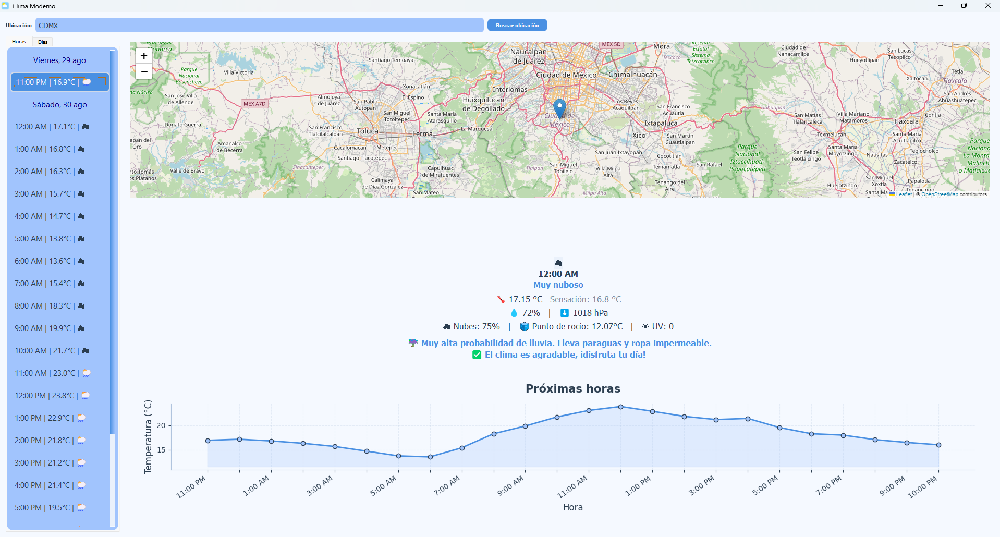

# Weather App

A modern weather application built with Python and PyQt5. This app allows you to search for any location and view detailed weather forecasts, including hourly and daily data, interactive maps, and temperature charts.

## Features

- **Search by location:** Enter a city, address, or place to get weather information.
- **Hourly and daily forecasts:** View weather details for the next 24 hours and 7 days.
- **Interactive map:** See the selected location on a map.
- **Temperature charts:** Visualize temperature trends with interactive graphs.
- **Weather recommendations:** Get suggestions based on weather conditions (rain, UV, temperature, etc.).
- **Modern UI:** Clean and user-friendly interface.

## Screenshots



## Installation

1. **Clone the repository:**

   ```bash

   git clone https://github.com/ErickHdzV/weather-app.git
   cd weather-app
   ```

2. **Create and activate a virtual environment (optional but recommended):**

   ```bash
   python -m venv venv
   venv\Scripts\activate  # On Windows
   ```

3. **Install dependencies:**

   ```bash
   pip install -r requirements.txt
   ```

4. **Set up environment variables:**

   Create a `.env` file in the project root with the following content:

   ```txt
   OPENWEATHER_API_KEY=your_openweather_api_key
   API_URL=api_url_from_openweathermap
   EMAIL_MAP=your_email@example.com
   ```

## Usage

Run the application with:

```bash
python main.py
```

## Requirements

- Python 3.8+
- PyQt5
- PyQtWebEngine
- requests
- python-dotenv
- folium
- matplotlib

Install all dependencies using the provided `requirements.txt`.

## Notes

- **API Key:** You need a free API key from [OpenWeatherMap](https://openweathermap.org/api).
- **Do not share your API key publicly.** Make sure your `.env` file is included in `.gitignore`.

## License

This project is licensed under the MIT License.

---

_Made with ❤️ by Erick HV_
